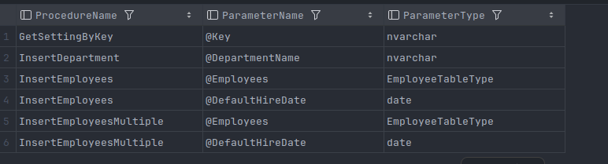

# **SimpleJdbcCallLogger**

#### **This projects demonstrates an wrapper over the SimpleJdbcCall to print the exact sql procedure call**

#### **You will be able to directly execute this line in the terminal as if you ran it from SQL**

##### If you want to run the project yourself, run docker compose up, then connect to the db with the credentials from [application.yaml](src/main/resources/application.yaml) and copy the [createScripts.sql](src/main/java/com/simpleJdbcLogger/Spring/Boot/Jdbc/Logger/createScripts.sql) contents and run it in terminal

**Example:**

```sql
DECLARE
@Employees as EmployeeTableType;
INSERT INTO @Employees
VALUES ('Calin', 1009, NULL),
       ('Radu', 1009, '2025-03-21'),
       ('George', 1009, '2025-03-21');
EXEC [InsertEmployeesMultiple] @Employees = @Employees, @DefaultHireDate = '2025-03-22';
```

```sql
EXEC [GetAllEmployees];
```

**Functionalities:**

* On startup it initialises from DB the
    * MAX_ROWS_TO_PRINT - So it doesnt show a huge log of values. Its for performance reasons
    * Ability to turn on/off this logger
* It caches these values so it doesn't have to query them again
* Calls a procedure from DB to pick up all the procedure parameters - it uses them to construct a map to replace the
  DECLARE @TABLE as (Column1 int, Column2 int) with @Declare TABLE as UserDefinedTable. But it has a fallback mechanism
  to do that in case the procedure called is a remote one / not in the current schema
    * Example:
    * 
* Converts the whole request into an executable sql statement to be able to debug easily, as seen in the example above
* 2 ways to initialize: Either by using new SimpleJdbcCallLogger - will not benefit from parameter translation, or with
  SimpleJdbcCallLoggerFactory - will benefit from customization regarding number of rows to print and parameter
  translation

**_Feel free to fork/copy the project and develop it further :)_**